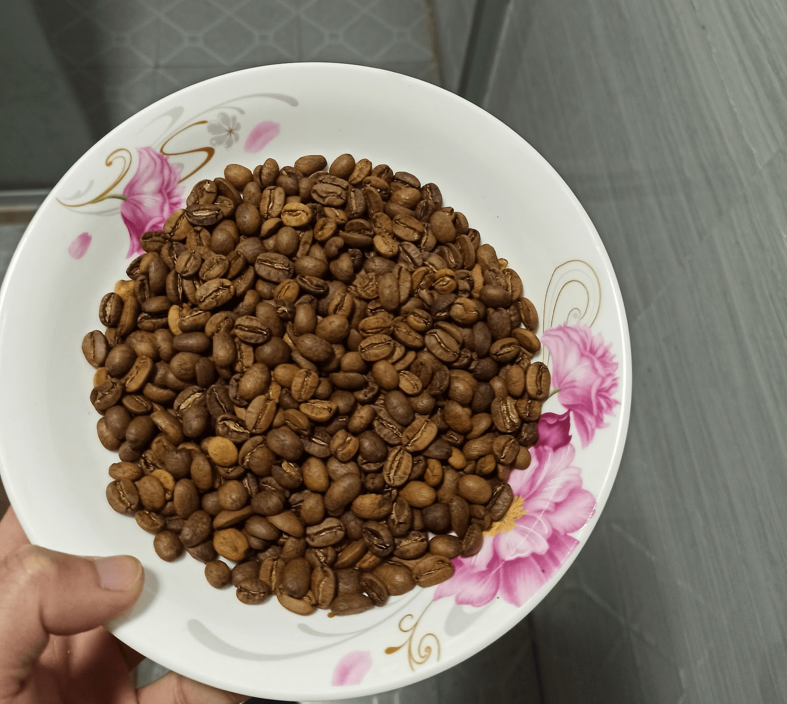

# 日晒曼特宁

## 2021-01-15

一爆声就关火的豆子。

理论上叫“城市烘焙”。

口味：酸汤的味道。和书里说的一样，浅中烘焙掌握得不好就会有泥土青草的酸味😂，但是有回味，烟草和坚果。

明天再冲一次试试。

（第二天手冲）

早上试了，还是酸，和刚烘焙出来的没两样。老板送的浅烘咖啡豆也酸，酸得明亮；我的豆子酸得浑浊，像是梅雨时节的池塘边的青草和泥土煮开的味道。林中三仙女熬的大锅汤。

而且闷蒸的时候咖啡粉没有鼓起来。

以后避免这种程度，要噼里啪啦响一阵再关火。