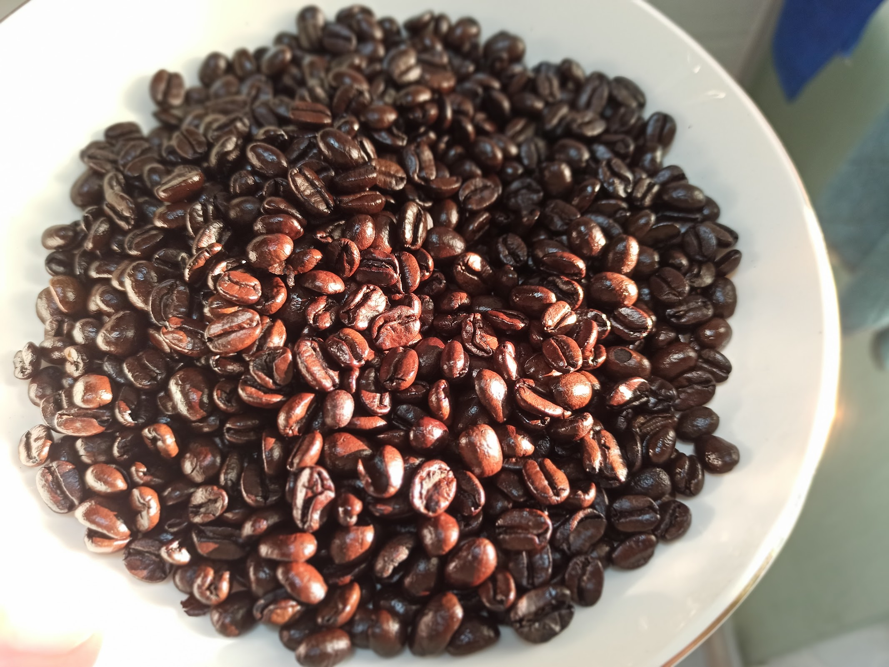

# 巴拿马圣特雷莎

圣特雷莎是巴拿马的一个咖啡庄园，这个咖啡豆来自圣特雷莎庄园。

rate：3

comment: 我拿它一直烘不出好口味，或者它本来就是这个味道？

## 3月中

烘焙：14分钟左右密集的一爆声落，继续烘到18分钟，期间没听到一声爆炸。

手冲：入口滋味寡淡，咽下去后味道才接连而来，先是烤番薯，后是烟草和坚果，最后嘴唇和齿颊间会留一点甘蔗甜。

## 3月底

圖為第二次密集爆后的下豆。豆子油光發亮。

手沖，焦苦，邊喝邊哭，自討苦吃。

## 4月5日

火：最小火。10分钟都没有听到一声爆炸，下炉。

磨起来像石头，喝起来像草汁。